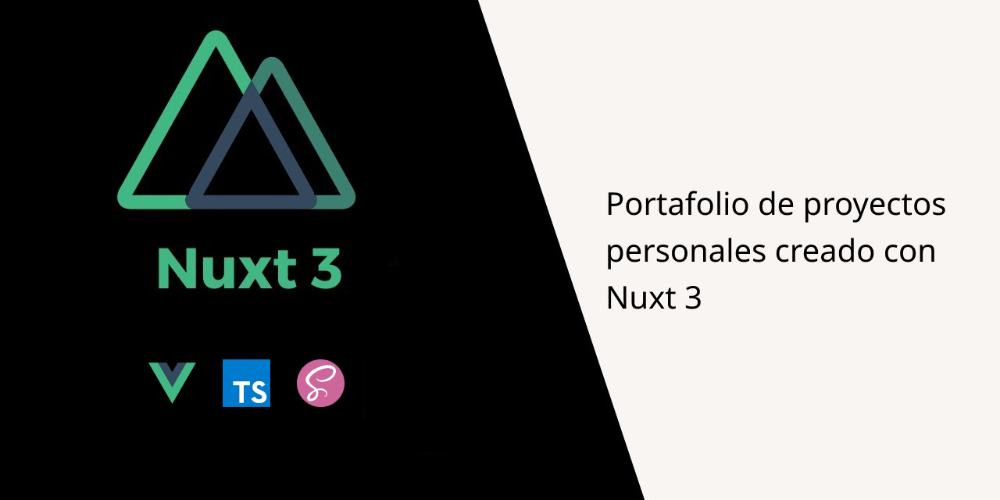
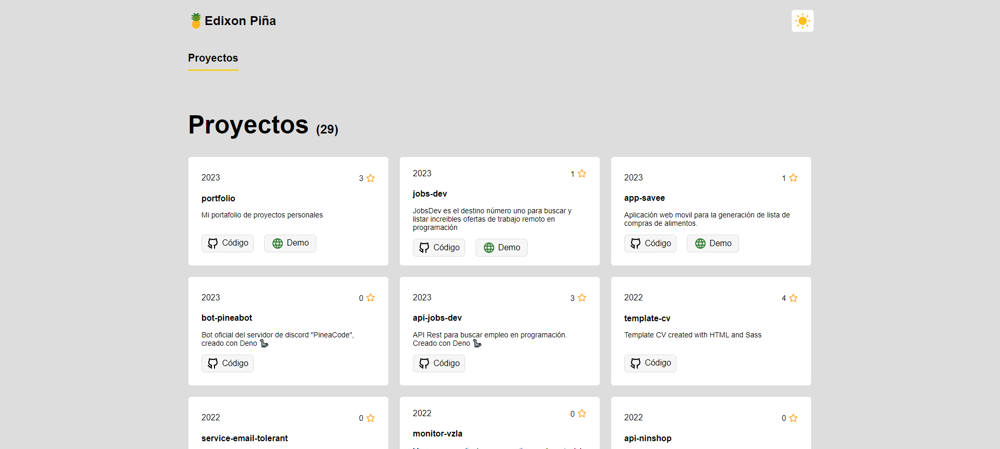

# Portfolio



Portafolio de proyectos personales.

### Comandos
```sh
# Compilar el proyecto.
pnpm build

# Iniciar el proyecto en modo desarrollo.
pnpm dev

# Compilar y preparar el proyecto para desplegar a producción.
pnpm generate

# Inicar servidor local para previsualizar el proyecto.
pnpm preview

# Formatear todos los archivos ubicados en /src usando prettier.
pnpm format
```

### Tecnologías Utilizadas

- Nuxt 3
- TypeScript
- Sass

### Previzualización


